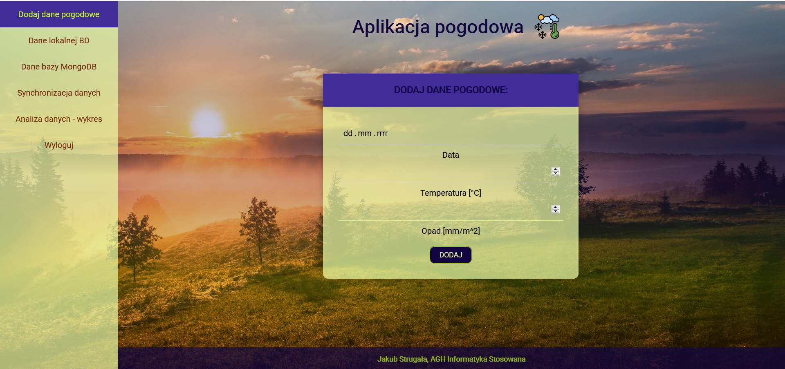
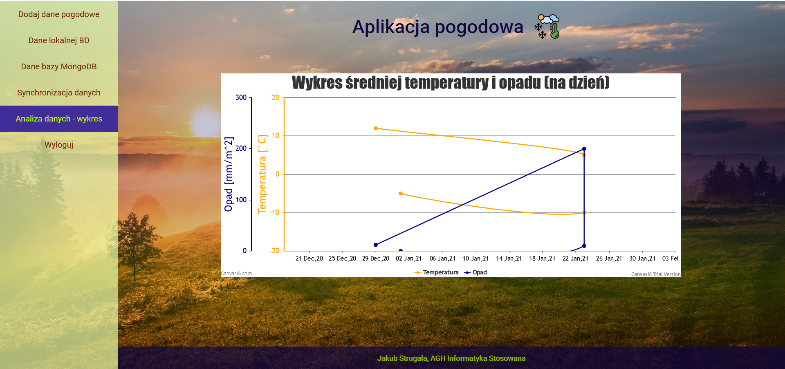

# Web-Technologies-Restful
Second project for Web Technologies classes concerning RESTful style using mainly PHP and JavaScript languages. 

## It is a simple Weather Application focusing on HTTP methods for RESTful services using offline and online mode.
In offline mode the data is sent to local DB of a browser - indexedDB, whereas in an online mode straightly to the mongoDB database.

### Main page

### Data analysis page

